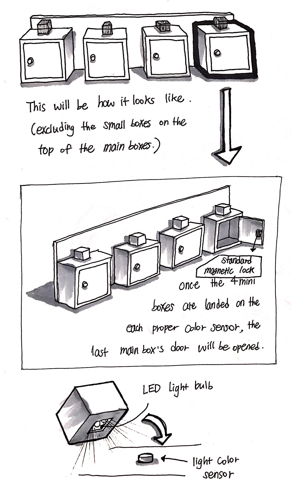

## Wall Escape

I propose to create a physical interactive game based on room escape game style 
which has riddles to solve inside of a room.

## Summary

In this project, there will be total 3 boxes on the wall (a foam board wall) 
and each box will have one riddle respectively. 
3 devices to lock the boxes are needed and one of them will use a color sensor. 
Other two devices will be physical ones, such as a padlock or 4 digit padlock.

The main goal of the project is to create a physical environment 
to see how people interact with it. To know how people feel about it 
and how this function can be applied in a different way in the future. 
This is very experimental and conducting this project itself will be a challenge to me.

  

## Component Parts

INPUT: 4 color sensors
OUTPUT: Standard magnetic lock

## Challenges

In this project, the challenge will be how to put the LED light bulbs in the mini boxes without showing any wires and how to make the audiences interact with this Wall Escape smoothly.

## Timeline

Week 1: -
Week 2: -
Week 3: Once the proposal approved, order the INPUT and OUTPUT and start making the Wall Escape with foam boards.
Week 4: Has to be done around 80%: Check if it has technical problem or any additional idea?
Week 5: Present! 

## References and link

https://www.frightprops.com/escape-rooms/escape-room-triggers/recessed-proximity-sensor-prop-trigger.html

At the bottom on the site, there is a video that represents well about the idea of Wall Escape. In the video, the 3 skulls device is the main idea I want to show.
